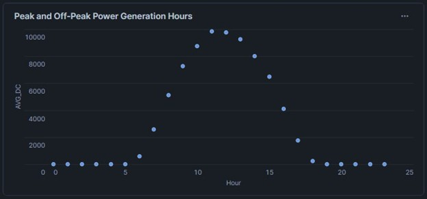
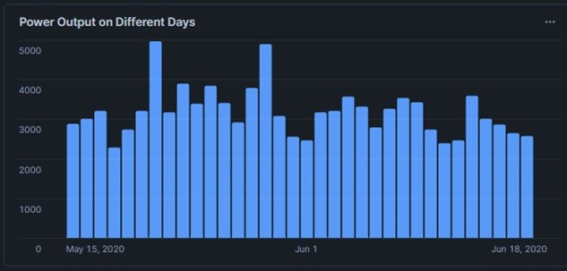
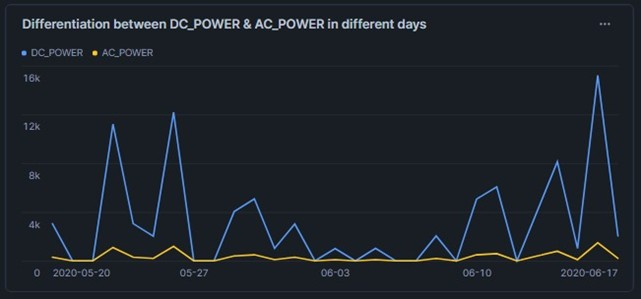
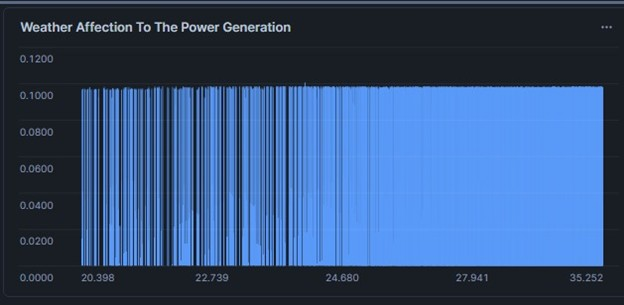
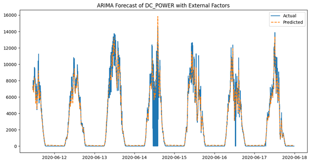

# 🔆 Real-Time Solar Power Analytics with Apache Spark & Snowflake

An end-to-end big data pipeline and analytics system for monitoring, forecasting, and optimizing solar power generation using cloud-based tools and scalable data processing frameworks. Developed as part of the **Big Data Analytics (PUSL3121)** coursework at NSBM Green University.

---

## 📌 Project Overview

This project leverages real-world solar energy and weather sensor data to implement a real-time analytics system. Key features:

- ⚡ **Data Ingestion & Preprocessing** using both **Apache Spark** and **Pandas**
- 🔍 **Performance Benchmarking** between Pandas vs Spark for big data operations
- ❄️ **Real-Time Cloud Analytics** using **Snowflake** with Snowpipe, Streams, and Tasks
- 📊 **Predictive Modeling** using Spark MLlib (Regression, Classification, Forecasting)
- 📈 **Interactive Dashboards** for live data visualization and decision support

---

## 🧰 Tech Stack

| Layer         | Tools & Frameworks                                |
| ------------- | ------------------------------------------------- |
| Preprocessing | Apache Spark, Pandas                              |
| ML Models     | Spark MLlib, ARIMA                                |
| Cloud & ETL   | Snowflake (Snowpipe, Streams, Tasks, Warehousing) |
| Dashboards    | Snowflake Visualizations                          |
| Dev Tools     | Google Colab, GitHub, Jupyter Notebooks           |

---

## 📁 Repository Structure

```

📦 BigData-SolarPower-Analytics/
├── README.md
├── .gitignore
├── report/
│   └── BigData_SolarPower_Analytics_Report.pdf
├── notebooks/
│   ├── PUSL3121\_Data\_Preprocessing\_Pandas.ipynb
│   ├── PUSL3121\_Data\_Preprocessing\_Spark.ipynb
│   ├── Apache\_Spark\_modeling.ipynb
│   └── Snowflake\_Streaming\_Code.ipynb
└── assets/
    ├── ac-vs-dc.jpg
    ├── arima-forecast.png
    ├── daily-output.jpg
    ├── peak-generation.jpg
    └── weather-effect.jpg

```

---

## 🧪 Machine Learning Models

| Model                        | Purpose                            | Metric   | Value   |
| ---------------------------- | ---------------------------------- | -------- | ------- |
| Linear Regression            | Predicting DC power                | R² Score | 0.624   |
| Random Forest Regressor      | DC power prediction                | R² Score | 0.99999 |
| Gradient Boosting Classifier | Power classification (High/Low)    | Accuracy | 99.24%  |
| ARIMA                        | Time series forecasting (DC_POWER) | RMSE     | 602.95  |

---

## 🔁 Real-Time Streaming Pipeline

Snowflake was used to simulate a real-time analytics environment with:

- **Snowpipe** for continuous data loading
- **Streams** for change detection
- **Tasks** for scheduled processing
- **Materialized views** for dashboard feeds

---

## 📊 Visual Dashboards

### Peak and Off-Peak Generation



### Daily Power Output



### AC vs DC Power Comparison



### Weather Effect on Power



### ARIMA Forecasting



---

## 📈 Dataset

We used the [Solar Power Generation Dataset](https://www.kaggle.com/code/pythonafroz/solar-power-generation-forecast/input) from Kaggle, which includes:

- `Plant_1_Generation_Data.csv`
- `Plant_1_Weather_Sensor_Data.csv`
- `Plant_2_Generation_Data.csv`
- `Plant_2_Weather_Sensor_Data.csv`

**Note**: Due to file size and licensing, raw data files are not included in the repository. Sample views are available in the notebooks.

---

## 🧑‍🤝‍🧑 Team Members

- **Sinel Nemsara**
- **Sachitha Eshan**
- **Yohan Nanayakkara**
- **Thejan Rajapaksha**

---

## 📄 Report

Refer to the detailed coursework submission in [`report/BigData_SolarPower_Analytics_Report.pdf`](./report/BigData_SolarPower_Analytics_Report.pdf) for full methodology, results, and evaluations.

---

## 🚀 How to Run

If you wish to run this project:

1. Upload data into a Snowflake table
2. Execute SQL queries from `Snowflake_Streaming_Code.ipynb`
3. Run notebooks in `Google Colab` or any Spark-enabled Jupyter environment

---

## ⚠️ Disclaimer

This project was submitted as part of academic coursework. Live streaming pipelines and cloud resources are no longer active.

---

## 🌐 License

This project is shared for educational purposes under the MIT License.
